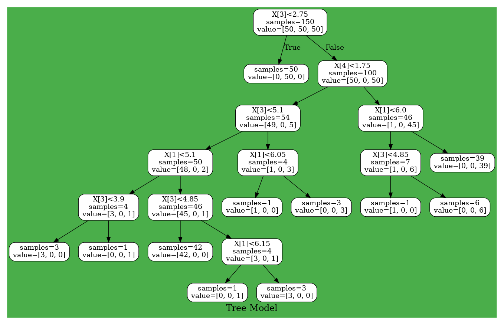

# Tree

## Decision Tree
From here, let's build a slightly more advanced model.
The first is decision tree analysis.
This model creates a tree structure classifier by creating nodes that recursively divide data.

### Train
Unlike other classifiers, this model doesn't require the data used for training to be in OneHot format, and it can be used as labels.
```
using LearningHorse.Preprocessing

using LearningHorse.Tree
using LearningHrse.Tree: fit!, predict

data = Matrix(dataloader("iris"))
x, t = data[:, 1:4], data[:, 5]

model = DecisionTree()
fit!(model, x, t)
```

### Visualize
Some of you may have seen it on LearningHorse's README.md. Let's visualize the trained decision tree using Graphviz!
First, let's make a dot file to visualize with Graphviz by the [`MV`](@ref) function.
```
MV("/home/ubuntu/Tree.dot", model, rounded = true, bgcolor = "#4aae4a", label = "Tree Model")
```
Next, it's done by visualizing it using Graphviz!
```
#In command line, if you haven't installed Graphviz, install with `sudo apt add graphviz`
$ dot -Tpng -o /home/ubuntu/Tree.png /home/ubuntu/Tree.dot
```
Let's look at Tree.png...


## RandomForest
RandomForest generates some DecisionTree(like [`SVC`](@ref)).
What is different from the decision tree is that you need to specify the number of decision trees to generate.
```
model = RandomForest(10)

fit!(model, x, t)
```
Visualization can be done in the same way.
```
MV("/home/ubuntu/Forest.dot", model, rounded = true, bgcolor = "#4aae4a", label = "Forest Model")
```
```
$ dot -Tpng -o /home/ubuntu/Forest.png /home/ubuntu/Forest.dot
```
!!! warning
    A bug has been found in the behavior of RandomForest's visualization. This bug will be fixed soon.